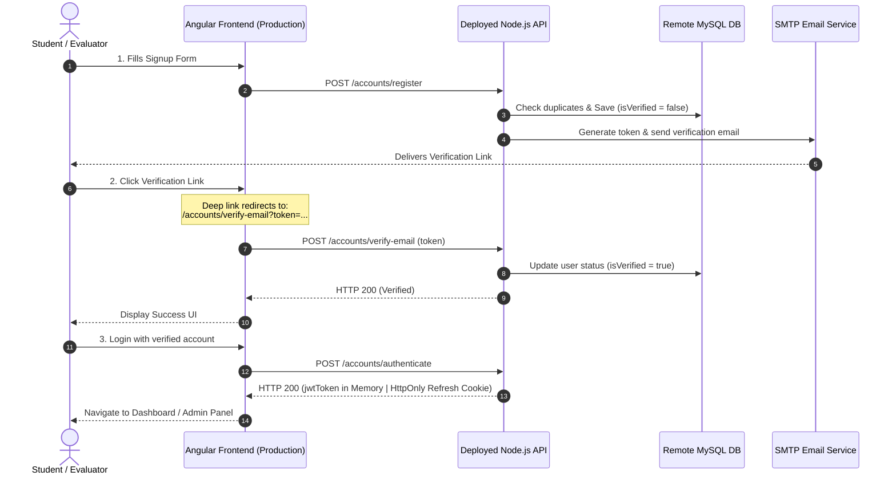

# 🎓 Full-Stack Authentication System
## Final Project & Examination Requirements Checklist

This document outlines the core requirements, setup instructions, and validation checklists for the **Final Project: Full-Stack Authentication System Deployment**. Use this as an interactive guide and submission template to ensure your project complies with all evaluation criteria.

---

## 📋 Table of Contents
- [1. GitHub Repository Audit](#1-github-repository-audit)
- [2. Backend Deployment (Node.js + MySQL)](#2-backend-deployment-nodejs--mysql)
- [3. Frontend Deployment (Angular 21)](#3-frontend-deployment-angular-21)
- [4. Evaluation Stages & Checklists](#4-evaluation-stages--checklists)
  - [Stage A: Functional Testing (Fake Backend)](#stage-a-functional-testing-fake-backend)
  - [Stage B: Integration Testing (Remote Backend)](#stage-b-integration-testing-remote-backend)

---

## 1. GitHub Repository Audit

The instructor will evaluate your codebase structure, commit patterns, and adherence to security best practices across two distinct repositories.

### 🔍 Audit Requirements

- [ ] **Two Distinct Repositories**:
  - **Backend Repo URL**: `__________________________________________________`
  - **Frontend Repo URL**: `__________________________________________________`
- [ ] **Commit History**:
  - Evidence of incremental development and frequent, logical commits.
  - Configuration changes clearly documented in commits (e.g., configuring `environment.prod.ts` or production database configs).
- [ ] **Security Best Practices (Zero Hardcoded Secrets)**:
  - No sensitive data (like `JWT_SECRET`, database passwords, or SMTP credentials) committed to GitHub.
  - All secret handling must be performed via environment variables or a `.env` file (which **must** be listed in your `.gitignore`).
- [ ] **Comprehensive README.md**:
  - Clear, basic setup and installation instructions for running the project locally.
  - Prominent, clickable links to your live, deployed applications.

> [!IMPORTANT]
> **Security Audit Warning**
> Any hardcoded secrets found in your repository history will result in an immediate deduction. Double-check your `.gitignore` before pushing code to GitHub!

---

## 2. Backend Deployment (Node.js + MySQL)

Your backend application must be fully functional, running on a public hosting service (e.g., Render, Railway, Heroku), and connected to a remote MySQL database instance (e.g., Aiven, AWS RDS, Clever Cloud).

### ⚙️ Backend Requirements Checklist

- [ ] **Live Public API URL**:
  - **Deployed URL**: `__________________________________________________`
- [ ] **Database Connectivity**:
  - Verify your Sequelize/Sequel instance successfully connects to the remote MySQL database instead of a local SQLite database in production.
- [ ] **Active API Documentation (`/api-docs`)**:
  - Swagger UI route must be active and testable online (e.g., `https://your-api.onrender.com/api-docs`).
- [ ] **Dynamic CORS Configuration**:
  - The `CORS_ORIGIN` environment variable on the server must point exactly to your deployed Angular frontend URL to allow secure, cross-site requests.
- [ ] **Email Verification Service**:
  - A real or mock SMTP service (like Ethereal Mail or Mailtrap) must be configured and fully functional. The backend must log that a verification email is sent upon registration.

---

## 3. Frontend Deployment (Angular 21)

Your frontend must be compiled as a production-optimized Single Page Application (SPA) and deployed to a web host (e.g., Render, Vercel, Netlify).

### ⚙️ Frontend Requirements Checklist

- [ ] **Live Public Frontend URL**:
  - **Deployed URL**: `__________________________________________________`
- [ ] **Production Build**:
  - App compiled using `ng build --configuration production`.
- [ ] **SPA Routing Rewrite Rule**:
  - Demonstrate implementation of rewrite rules to prevent **404 errors** on deep links (like `/accounts/verify-email?token=...`).

#### Rewrite Configurations by Platform

| Hosting Platform | Configuration Method | Rule Details |
| :--- | :--- | :--- |
| **Render** | Static Site Dashboard -> **Redirects/Rewrites** | **Source**: `/*` <br> **Destination**: `/index.html` <br> **Action**: `Rewrite` |
| **Netlify** | `_redirects` file in root directory | `/*    /index.html   200` |
| **Vercel** | `vercel.json` file in root directory | `{"rewrites": [{"source": "/(.*)", "destination": "/index.html"}]}` |

> [!TIP]
> **Why is this Rewrite Rule Critical?**
> In a Single Page Application (SPA), the browser handles routing locally. If a user clicks an email verification link directly, the host server receives the request first. Without a rewrite rule, the server looks for a physical directory structure that does not exist and returns a 404. The rewrite rule tells the server to always serve `index.html` and let Angular's router handle the URL path!

---

## 4. Evaluation Stages & Checklists

### 🧪 Stage A: Functional Testing (Fake Backend)
*Objective: Prove that all Angular routing, components, guards, and services operate flawlessly in isolation before deploying.*

- [ ] **Enable Fake Backend**:
  - In your Angular project, configure the application to use the built-in "Fake Backend" interceptor (typically configured in `app.module.ts` or main app config).
- [ ] **Sign Up Validation**:
  - Register a test user. Confirm that correct client-side validation triggers and that registration returns a mock success response.
- [ ] **Mock Email Verification Alert**:
  - Ensure that a clean alert or UI notification is displayed indicating a mock verification link has been generated.
- [ ] **Secure Login**:
  - Log in with your newly created mock credentials.
- [ ] **Role-Based Access Control (RBAC)**:
  - Log in as an **Admin** user and verify you can access the Admin management area.
  - Log in as a normal **User** and verify you are restricted from the Admin dashboard and redirected back to the homepage.

---

### 🚀 Stage B: Integration Testing (Remote Backend)
*Objective: Disable mock logic, connect to your live API and remote MySQL database, and execute the complete, end-to-end full-stack authentication flow.*



- [ ] **Deactivate Fake Backend**:
  - Set `useFakeBackend: false` or disable the mock interceptor in `app.module.ts` / app configurations.
- [ ] **Configure Remote API Environment**:
  - Update `src/environments/environment.prod.ts` with the public URL of your deployed Node.js backend:
    ```typescript
    export const environment = {
      production: true,
      apiUrl: 'https://your-node-backend-url.onrender.com',
      useFakeBackend: false
    };
    ```
- [ ] **Sign Up End-to-End**:
  - Register a new account on the live deployed Angular site.
- [ ] **Email Verification Flow**:
  - Check your SMTP logger (Ethereal Mail, Mailtrap, or a live inbox).
  - Locate the verification email and click the verification deep link.
  - Verify that the frontend handles the token, requests the remote backend, and the MySQL database updates `isVerified = 1`.
- [ ] **Token Inspection (JWT + Refresh Cookie)**:
  - Log in to the application.
  - Open DevTools -> **Application** -> **Cookies**. Confirm that the secure `refreshToken` cookie is successfully set.
  - Verify that the access `jwtToken` is kept securely in browser/application state memory and is **not** stored in insecure `localStorage` or `sessionStorage`.
- [ ] **RBAC Verification**:
  - Log in with the **first registered account** (which typically defaults to the **Admin** role). Confirm access to the **Admin Management Panel**.
  - Log in with a **second registered account** (defaults to **User** role). Confirm that access to the Admin Dashboard is strictly blocked and securely guarded.

---

### 📝 Evaluation Summary Sign-Off
*To be filled out during the live demonstration with your evaluator.*

| Stage | Requirement Description | Status | Evaluator Signature |
| :--- | :--- | :--- | :--- |
| **Stage A** | Mock client-side authentication flow | `[ ] PASS / [ ] FAIL` | `_________________` |
| **Stage B** | Production full-stack deployment & RBAC | `[ ] PASS / [ ] FAIL` | `_________________` |
| **Audit** | Security check & environment configs | `[ ] PASS / [ ] FAIL` | `_________________` |

*Good luck with your final evaluation! Ensure all environment variables are correctly deployed and test all routes before submitting.*
